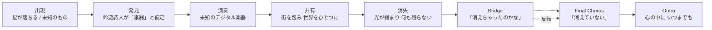

# キミの音色を教えて　#あなたの音色を聴かせて

## Source Facts

- **Creator:** Haggar_1001
- **Source:** https://suno.com/song/43644dcc-2a3e-4465-bbe0-bf487f9a0dab?sh=cmDaraBeZj9tohyC
- **Creator URL:** https://suno.com/@haggar_1001
- **Collected at:** 2026-10-04T14:04:28.879Z
- **Published on page:** 2026年10月4日 14:27
- **Model shown on page:** V6
- **Duration shown on page:** 4:24
- **Play count shown on page:** 37

### Caption (raw)

```text
音色さん、おめでとうございます💕
```

### Style (raw)

```text
Electronic fantasy orchestration with a beautiful, emotional female vocal, moving from intimate spoken lines to a soaring chorus; a shifting, crystalline digital instrument entwined with digital bells, granular textures, organic instruments, and glacial synths; stutter-edit glitches and a mysterious instrumental fade; quiet, curious pulse building into an uplifting sway, then a bittersweet final chorus with fragments of the melody
```

### Lyrics (raw)

```text
/🔮♥️🐈🎵🔮♥️🐈🎵🔮♥️🐈🎵🔮♥️🐈🎵
🎉音色さん、1周年＆Sunoフォロワーさま1000人記念企画🎉
『 #あなたの音色を聴かせて 』　参加曲
詳細はこちら
👇　👇　👇　👇
https://x.com/neiro_suno05/status/2104043352912232654?s=20
🔮♥️🐈🎵🔮♥️🐈🎵🔮♥️🐈🎵🔮♥️🐈🎵

[Intro]
[spoken female vocals]
それは、突然現れた――

[Verse 1]
夜空を裂いて　星が落ちた
街の外れに　響く轟音
駆けつけたみんなが　見つめてる
そこにあったのは　見たことのないもの

[Pre-Chorus]
丸くて　不思議で
光をまとって　静かに眠る
誰も知らない　誰も触れない
これはいったい　何なの？

[Verse 2]
旅人の吟遊詩人が
そっと近づいて　つぶやいた
「これはきっと　楽器なんじゃないか？」
「私が鳴らしてみよう」

[Instrumental Break]
[unknown digital instrument]
♪ ♪ ♪
[glitchy digital tones]
[hybrid acoustic and electronic sounds]
[unusual melodic textures]

[Chorus]
聞いたことのない　キミの音色
空気を震わせ　街を包んで
知らないはずなのに　懐かしくて
みんなの心を　そっと奪った

踊るように　揺れるように
音に身を預けていく
キミの音色は　不思議な魔法
世界をひとつに　変えていく

[Verse 3]
どれくらいの　時間が経った？
光が少しずつ　弱くなって
気づいたときには　そこにはもう
何も残らず　消えていた

[Pre-Chorus]
もう一度だけ　聴きたい
あの不思議な　音色を
だけど空には　いつもの星
静かな夜が　戻ってきた

[Bridge]
[soft female vocals]
もう二度と　聴けないのかな
あの音色は　消えちゃったのかな

[whispered female vocals]
いいえ――

[Final Chorus]
キミの音色は　消えていない
心の奥で　今も響いてる
言葉にできない　あのメロディ
胸の奥で　鳴り続ける

いつか誰かに　尋ねられたら
「キミの音色を　教えて」と
私はきっと　笑って答える
「ずっとここで　聴こえているよ」

[Outro]
[spoken female vocals]
キミの音色は――
心の中に、いつまでも。
```

---

## Clean Lyrics

### [Intro]
それは、突然現れた――

### [Verse 1]
夜空を裂いて星が落ちた。  
街の外れに響く轟音。  
駆けつけたみんなが見つめてる。  
そこにあったのは、見たことのないもの。

### [Pre-Chorus]
丸くて、不思議で、光をまとって静かに眠る。  
誰も知らない、誰も触れない。  
これはいったい、何なの？

### [Verse 2]
旅人の吟遊詩人がそっと近づいてつぶやいた。  
「これはきっと楽器なんじゃないか？」  
「私が鳴らしてみよう」

### [Chorus]
聞いたことのないキミの音色。  
空気を震わせ、街を包んで。  
知らないはずなのに懐かしくて、みんなの心をそっと奪った。

踊るように、揺れるように、音に身を預けていく。  
キミの音色は不思議な魔法。  
世界をひとつに変えていく。

### [Verse 3]
どれくらいの時間が経った？  
光が少しずつ弱くなって、気づいたときにはそこにはもう、何も残らず消えていた。

### [Pre-Chorus]
もう一度だけ聴きたい、あの不思議な音色を。  
だけど空にはいつもの星。  
静かな夜が戻ってきた。

### [Bridge]
もう二度と聴けないのかな。  
あの音色は消えちゃったのかな。

いいえ――

### [Final Chorus]
キミの音色は消えていない。  
心の奥で今も響いてる。  
言葉にできないあのメロディ。  
胸の奥で鳴り続ける。

いつか誰かに尋ねられたら、  
「キミの音色を教えて」と。  
私はきっと笑って答える。  
「ずっとここで聴こえているよ」

### [Outro]
キミの音色は――  
心の中に、いつまでも。

---

## Lyrics Analysis

### Summary

未知の「楽器」とその音色の出現・共有・消失を経て、最後には物理的に失われた音が記憶の中に残ると捉え直す物語。企画名の「あなたの音色」を、異世界から訪れた正体不明の音として物語化している。

### Themes

- 未知の音との出会い
- 共同体をひとつにする音楽
- 喪失と記憶への内在化
- 音色を受け継ぎ語ること

### Core Keywords

- キミの音色
- 楽器
- 星
- 光
- 魔法
- 心の奥
- メロディ

### Symbols / Motifs

- 落ちる星／未知の物体
- 吟遊詩人
- 光
- 音色
- 消失
- 心に残る響き

### Perspective

主に一人称「私」を含む語り手が、街の人々とともに未知の音を体験する。Final Chorusでは共同体の体験から個人の記憶へ焦点が移る。

### Narrative / Semantic Progression

1. 未知の物体が出現
2. 吟遊詩人が楽器と仮定して鳴らす
3. 音が街全体を包む
4. 物体が消える
5. 喪失を嘆く
6. 音は心の中に残ると再定義

### Repetition / Contrast / Notable Wording

- 企画テーマ「音色」を、単に歌詞で称えるのではなく「未知の楽器」の物語へ置き換えた点。
- 街全体をひとつにした音が、消失後は個人の心の中へ移るスケール変化。
- Bridgeの「消えちゃったのかな」→囁きの「いいえ――」→「消えていない」という明確な反転。

---

## Structure Analysis

- **Structure type:** `linear_narrative + contrast_reversal`
- **Summary:** 出現→発見→演奏→共有→消失→内在化という一本道の物語に、Bridgeの「消えたのかな」からFinal Chorusの「消えていない」への反転を重ねる。

### Mermaid



### Structural Notes

- 企画テーマ「音色」を、単に歌詞で称えるのではなく「未知の楽器」の物語へ置き換えた点。
- 街全体をひとつにした音が、消失後は個人の心の中へ移るスケール変化。
- Bridgeの「消えちゃったのかな」→囁きの「いいえ――」→「消えていない」という明確な反転。

---

## Suno Prompt Knowledge

### Style Raw

```text
Electronic fantasy orchestration with a beautiful, emotional female vocal, moving from intimate spoken lines to a soaring chorus; a shifting, crystalline digital instrument entwined with digital bells, granular textures, organic instruments, and glacial synths; stutter-edit glitches and a mysterious instrumental fade; quiet, curious pulse building into an uplifting sway, then a bittersweet final chorus with fragments of the melody
```

### Directives Observed in Lyrics

| Directive | Position | Structural role | Source/Inference |
|---|---|---|---|
| `[spoken female vocals]` | Intro / Outro | 物語の扉と余韻を会話的な声で縁取る | Page-derived directive + AI structural interpretation |
| `[Instrumental Break] + [unknown digital instrument]` | Verse 2後 | 物語上の未知の楽器そのものを歌詞外の音区間として提示 | Page-derived directive + AI structural interpretation |
| `[glitchy digital tones] / [hybrid acoustic and electronic sounds] / [unusual melodic textures]` | Instrumental Break | 未知性をデジタル／有機の混成として指示 | Page-derived directive + AI structural interpretation |
| `[soft female vocals]` | Bridge | 喪失感の弱まりを声量・質感で指定 | Page-derived directive + AI structural interpretation |
| `[whispered female vocals]` | Bridge末尾 | 「いいえ――」を転換点として強調 | Page-derived directive + AI structural interpretation |

### Reusable Notes

- 物語中の「未知の音」をInstrumental Breakで実際の音響イベントとして割り当てる設計。
- Bridgeの問いを囁き一語で反転し、そのままFinal Chorusへ意味を反転させる構造。
- Style上でcrystalline digital instrument / digital bells / granular textures / organic instrumentsを混在させ、正体不明の音色を多層で指定している。

---

## Az Listening Notes

> No listening note yet.

### Raw Notes from Az

-

### Structured Listening Tags

- **Perceived mood:**
- **Perceived instrumentation / texture:**
- **Energy change:**
- **Vocal impression:**
- **Favorite sonic moment:**
- **Useful reference for:**

> These fields must be based on Az's own listening notes. Do not infer them from audio files, Style, or lyrics alone.

---

## Az Impression

### Raw Notes from Az

> No Az note yet.

### Structured Impression

- **First impression:**
- **Favorite moment:**
- **Emotion words:**
- **Colors / scenery:**
- **Physical sensation:**
- **What felt unusual:**
- **Useful reference for:**

---

## Review Hooks

Points worth discussing when Az writes a review. These are prompts, not a finished review.

- 企画テーマ「音色」を、単に歌詞で称えるのではなく「未知の楽器」の物語へ置き換えた点。
- 街全体をひとつにした音が、消失後は個人の心の中へ移るスケール変化。
- Bridgeの「消えちゃったのかな」→囁きの「いいえ――」→「消えていない」という明確な反転。

---

## Provenance / Confidence

- **Page-derived facts:** title / creator / URLs / published date / model / duration / caption status / style / raw lyrics / play count
- **AI text analysis:** Clean Lyrics / themes / motifs / semantic progression / structure classification / Mermaid / reusable notes
- **Az listening notes:** none yet
- **Az impression:** none yet
- **Unavailable / uncertain:** 実際の音響効果・ボーカル質感・Style指定の実現度は未評価

### Audio Handling Policy

- Do not search for direct audio file URLs.
- Do not download or convert m4a/mp3/wav files.
- Do not perform automated audio analysis.
- Sound-related notes must come from Az's own listening comments.
