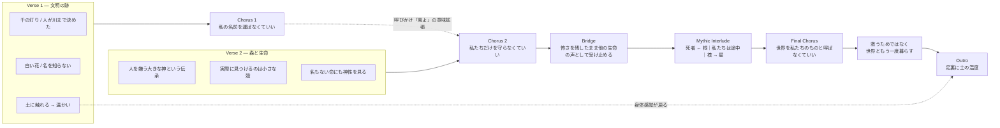

# 土の下で朝を待つ

## Source Facts

- **Creator:** Kamo（高知県）
- **Source:** https://suno.com/song/0acaa155-b7c8-48c4-8584-e7de01b6255d
- **Creator URL:** https://suno.com/@kondokazudeskkk
- **Collected at:** 2026-09-28T16:14:01.704Z
- **Published on page:** 2026年9月23日 13:48
- **Model shown on page:** V6
- **Duration shown on page:** 6:35

> **取得上の注意:** Workが公開ページで取得した `style_raw` は末尾が `Subtle Repeatin` で途切れていました。公開ページ側の展開表示 / Copy styles相当で確認できた内容自体がそこで終わっていた、という記録がRaw JSONにあります。以下では、取得できた範囲だけを一次情報として扱います。

### Caption (raw)

```text
滅びた町の向こうで、森は今日も静かに息をしている。
人がいなくても朝は来る。それでも私は、その朝を見ていたい。

世界を救うためじゃない。
傷ついた大地と、もう一度いっしょに暮らしていくために。

土に触れた手には、まだ小さな温もりが残っていた。🌿✨🦆✨
```

### Style (raw, page-visible portion)

```text
1980s Japanese Mythic Fantasy Film Music, Ancient-Future Chamber Orchestra, Minimalist Repetitive Motifs, Ethereal Female Vocal, Clear, Gentle, Human, Slightly Distant Voice, Mysterious, Sacred, Earthy, Wind-Swept, Post-Civilization Atmosphere, Ancient Myth Meeting a Forgotten Future, Melancholic but Life-Affirming, Awe Without Heroic Triumph, Slow to Mid Tempo, Low Rhythmic Density, Large Breathing Spaces, Ancient Wooden Flute, Soft Ocarina-Like Woodwind, Marimba and Vibraphone, Low Frame Drums, Small Hand Percussion, Warm Cello and Viola, Sparse String Ensemble, Harp Harmonics, Analog Synth Pads, Early Digital Synth Textures, Soft Bell Tones, Deep Organic Drone, Intro:
Wind-Like Ambient Texture, Single Ancient Woodwind, Sparse Bell, Very Distant Female Humming, Feels Like Ruins Before Sunrise, Verse:
Close to Medium-Distant Female Vocal, Minimal Percussion, Repeating Marimba Motif, Sparse Cello, Keep the Arrangement Fragile, Pre-Chorus:
Low Strings Slowly Enter, Subtle Repeatin
```

### Lyrics (raw)

```text
[Intro]

風が

古い塔を抜けてゆく

誰も読めない文字を

砂が

ひとつずつ

消していた

その向こうで

森だけが

息をしている

[Verse 1]

昔

ここには

千の灯りがあったという

夜を昼に変え

川の流れさえ

人が決めていたという

今は

割れた石の隙間から

白い花が咲いている

私は

その名前を知らない

知らないまま

しゃがんで

そっと

土に触れた

温かかった

[Pre-Chorus]

母は言った

土の下には

死んだものだけが

眠るのではない

まだ

生まれていないものも

暗い場所で

朝を待っている

[Chorus]

風よ

私の名前を

運ばなくていい

この世界に

残らなくてもいい

ただ

この手で触れた土が

いつか

誰かの足の下で

やわらかければいい

人がいなくても

朝は来る

それでも私は

朝を

見ていたい

[Verse 2]

森の奥には

入ってはいけないと

みんなが言った

そこには

古い神がいる

人を嫌う

大きな神がいると

だけど

森の入口で

見つけたのは

折れた角でも

牙でもなく

小さな殻だった

何かが

ここで生まれ

どこかへ

歩いていった跡

[Pre-Chorus]

神様は

空の上にいると

思っていた

けれど

腐った葉の下にも

雨の粒にも

名前を持たない命にも

同じものが

いるのかもしれない

[Chorus]

風よ

私たちだけを

守らなくていい

鳥にも

虫にも

草にも

同じ朝を

連れてきて

生きることは

奪うことと

きっと

離せないから

せめて私は

奪ったものを

忘れずにいたい

[Bridge]

夜明け前

森の奥で

何かが鳴いた

私は

怖くなって

一歩

後ろへ下がった

それでも

逃げなかった

勇気が

あったからじゃない

その声もまた

ここで

生きている声だと

思ったから

[Mythic Interlude]

昔の人は

世界を支える木が

あると言った

根は

死者の国へ

枝は

星の国へ

そして

私たちは

その途中に

ほんの少し

住んでいる

[Final Chorus]

風よ

私の名前を

覚えなくていい

この世界を

私たちのものと

呼ばなくていい

ただ

傷ついた土から

また草が生まれる朝を

私は

ここで見ていたい

滅びたものも

生まれるものも

同じ土の中にいる

だから

今日を

始めよう

世界を

救うためじゃない

世界と

もう一度

暮らすために

[Outro]

朝日が

森の端に触れる

白い花が

風に揺れた

私は

立ち上がる

足の裏に

まだ

土の温度が

残っていた
```

---

## Clean Lyrics

### [Intro]

風が古い塔を抜けてゆく。  
誰も読めない文字を、砂がひとつずつ消していた。  
その向こうで、森だけが息をしている。

### [Verse 1]

昔、ここには千の灯りがあったという。  
夜を昼に変え、川の流れさえ人が決めていたという。

今は、割れた石の隙間から白い花が咲いている。  
私はその名前を知らない。  
知らないまま、しゃがんで、そっと土に触れた。  
温かかった。

### [Pre-Chorus]

母は言った。  
土の下には、死んだものだけが眠るのではない。  
まだ生まれていないものも、暗い場所で朝を待っている。

### [Chorus]

風よ、私の名前を運ばなくていい。  
この世界に残らなくてもいい。

ただ、この手で触れた土が、いつか誰かの足の下でやわらかければいい。

人がいなくても朝は来る。  
それでも私は、朝を見ていたい。

### [Verse 2]

森の奥には入ってはいけないと、みんなが言った。  
そこには古い神がいる。  
人を嫌う、大きな神がいると。

だけど森の入口で見つけたのは、折れた角でも牙でもなく、小さな殻だった。  
何かがここで生まれ、どこかへ歩いていった跡。

### [Pre-Chorus]

神様は空の上にいると思っていた。  
けれど、腐った葉の下にも、雨の粒にも、名前を持たない命にも、同じものがいるのかもしれない。

### [Chorus]

風よ、私たちだけを守らなくていい。  
鳥にも、虫にも、草にも、同じ朝を連れてきて。

生きることは奪うことと、きっと離せないから。  
せめて私は、奪ったものを忘れずにいたい。

### [Bridge]

夜明け前、森の奥で何かが鳴いた。  
私は怖くなって、一歩後ろへ下がった。

それでも逃げなかった。  
勇気があったからじゃない。  
その声もまた、ここで生きている声だと思ったから。

### [Mythic Interlude]

昔の人は、世界を支える木があると言った。  
根は死者の国へ、枝は星の国へ。  
そして私たちは、その途中にほんの少し住んでいる。

### [Final Chorus]

風よ、私の名前を覚えなくていい。  
この世界を、私たちのものと呼ばなくていい。

ただ、傷ついた土からまた草が生まれる朝を、私はここで見ていたい。

滅びたものも、生まれるものも、同じ土の中にいる。  
だから今日を始めよう。

世界を救うためじゃない。  
世界と、もう一度暮らすために。

### [Outro]

朝日が森の端に触れる。  
白い花が風に揺れた。

私は立ち上がる。  
足の裏に、まだ土の温度が残っていた。

---

## Lyrics Analysis

### Summary

滅びた文明の跡を歩く一人称の語り手が、土・森・小さな命・神話的世界観との接触を通して、「世界を人間のために支配し、救う」という発想から離れていく歌。最初のサビでは自分の名を残さなくてもいいと語り、二度目のサビでは保護の対象を人間だけに限定しない視点へ進み、最終サビでは「この世界を私たちのものと呼ばなくていい」と所有の発想そのものを手放す。最後は抽象的な救済ではなく、足の裏に残る土の温度という身体感覚へ戻る。

### Themes

- 人間中心主義から共生への視点転換
- 文明の滅びと、生態系の継続
- 死者と未生のものが同じ土にいるという循環観
- 神を超越的存在ではなく、名もない生命の中にも感じる視点
- 生きることに伴う「奪うこと」を忘れない倫理
- 英雄的な救済より、世界と再び暮らすこと

### Core Keywords

- 土
- 朝
- 風
- 名前
- 森
- 命
- 神
- 温度
- 白い花
- 世界

### Symbols / Motifs

- **土:** 死・未生・記憶・再生を同時に抱える基盤。抽象的な大地ではなく、手や足で触れる身体的な対象でもある。
- **朝:** 人間の存続とは無関係に訪れる時間。後半では「誰にでも来る朝」から「傷ついた土から草が生まれる朝」へ具体化する。
- **風:** 名を運ぶ媒体として最初に呼びかけられるが、その役割を拒否することで「記名・記憶されること」への執着を手放す。
- **名前:** 自分を残すための記号でありながら、白い花や名もない命を通じて、名前がなくても存在価値は失われないという方向へ意味が変化する。
- **森:** 文明の外部、恐れられる領域、そして人間以外の生命が続いている場所。
- **白い花 / 小さな殻:** 巨大な文明や「大きな神」と対照をなす、小さく具体的な生命の証拠。
- **世界樹:** 死者・星・現在の人間を縦につなぎ、人間を世界の中心ではなく「途中にほんの少し住むもの」と位置づけ直す装置。
- **温度:** 結末で思想を身体へ着地させるモチーフ。冒頭近くの「土に触れた／温かかった」とOutroの「足の裏に／土の温度」が対応する。

### Perspective

一人称の「私」が、滅びた文明跡と森の境界を歩きながら世界観を更新していく。語りは観察→記憶・伝承→身体接触→倫理的な自己定位へ進む。母の言葉や昔の人の神話を受け継ぎつつも、そのまま信じるのではなく、目の前の花・殻・声・土を通して自分の理解へ変えている。

### Narrative / Semantic Progression

1. **文明の不在を観察する:** 塔、読めない文字、砂、森。
2. **支配の記憶を知る:** 灯り、昼夜、川の流れまで人が決めていた過去。
3. **土に触れる:** 知らない白い花と温かい土が、滅びの跡に生があることを示す。
4. **死／未生を同じ土で捉える:** 母の言葉により、地下が終わりだけでなく始まりの場所になる。
5. **自己名誉を手放す:** 名前を運ばなくていい、残らなくてもいい。
6. **神と生命の位置を更新する:** 空の上だけでなく、腐葉・雨・名もない命の中にも同じものを見る。
7. **保護対象を人間から全生命へ広げる:** 私たちだけを守らなくていい。
8. **加害性を引き受ける:** 生きることと奪うことを切り離さず、忘れないことを選ぶ。
9. **世界の所有権を手放す:** 「私たちのもの」と呼ばなくていい。
10. **救済から共生へ:** 世界を救うのではなく、世界と暮らし直す。
11. **身体へ戻る:** 足裏に残る土の温度で終わる。

### Repetition / Contrast / Notable Wording

- 「風よ」が各サビの入口として反復され、そのたびに要求が変わる。
  - 1回目: **私の名前を運ばなくていい**
  - 2回目: **私たちだけを守らなくていい**
  - 最終: **私の名前を覚えなくていい / この世界を私たちのものと呼ばなくていい**
- 「名前」は自己の記憶・記名から、名を持たない生命の価値へと反転する。
- Verse 1の「千の灯り」「川の流れさえ人が決めていた」という巨大な文明の力と、Verse 2の「小さな殻」という微小な生命の痕跡が強く対照される。
- 「勇気があったからじゃない」は英雄譚への否定として重要。恐怖が消えたのではなく、他の生命の声として理解したため留まる。
- 「世界を救うためじゃない / 世界ともう一度暮らすために」が、作品全体の価値観を最も短く言い換える対句。
- Intro付近の「土に触れた / 温かかった」とOutroの「足の裏に / 土の温度が残っていた」が環状に対応し、思想の変化を身体感覚で挟み込む。

---

## Structure Analysis

- **Structure type:** `hybrid: parallel_evolution + spiral_repetition + dual_layer`
- **Summary:** Verse 1 / Verse 2で「文明の跡」と「森・生命」の対照を並行させ、各Chorusで同じ呼びかけ「風よ」に戻りながら対象と倫理を拡張する。Mythic Interludeでは死者―人間―星という垂直軸を導入し、Final Chorusで所有と救済の発想を手放す。最後はIntro付近の土の温度へ戻るため、螺旋的に同じ場所へ帰りながら意味が進んでいる。

### Mermaid



### Structural Notes

- Verse 1とVerse 2は「巨大な文明／大きな神」という大きな概念から、「白い花／小さな殻」という小さな具体物へ視点を落とす点で対応する。
- 3つのChorusは同じ「風よ」で始まるが、自己名誉→人間だけの保護→所有権そのもの、という順で手放す対象が大きくなる。
- Mythic Interludeは物語の寄り道ではなく、人間を世界の中心から「途中にほんの少し住む存在」へ配置し直す役割を持つ。
- Outroは思想的な結論を説明し直さず、土の温度だけを残すため、歌全体を身体感覚へ閉じる。

---

## Suno Prompt Knowledge

### Style Raw

> Rawは公開ページ上で取得できた範囲のみ。末尾は `Subtle Repeatin` で途切れている。

```text
1980s Japanese Mythic Fantasy Film Music, Ancient-Future Chamber Orchestra, Minimalist Repetitive Motifs, Ethereal Female Vocal, Clear, Gentle, Human, Slightly Distant Voice, Mysterious, Sacred, Earthy, Wind-Swept, Post-Civilization Atmosphere, Ancient Myth Meeting a Forgotten Future, Melancholic but Life-Affirming, Awe Without Heroic Triumph, Slow to Mid Tempo, Low Rhythmic Density, Large Breathing Spaces, Ancient Wooden Flute, Soft Ocarina-Like Woodwind, Marimba and Vibraphone, Low Frame Drums, Small Hand Percussion, Warm Cello and Viola, Sparse String Ensemble, Harp Harmonics, Analog Synth Pads, Early Digital Synth Textures, Soft Bell Tones, Deep Organic Drone, Intro:
Wind-Like Ambient Texture, Single Ancient Woodwind, Sparse Bell, Very Distant Female Humming, Feels Like Ruins Before Sunrise, Verse:
Close to Medium-Distant Female Vocal, Minimal Percussion, Repeating Marimba Motif, Sparse Cello, Keep the Arrangement Fragile, Pre-Chorus:
Low Strings Slowly Enter, Subtle Repeatin
```

### Directives Observed in Lyrics

| Directive | Position | Structural role | Source/Inference |
|---|---|---|---|
| `[Intro]` | opening | 廃墟・風・森を提示する導入 | lyrics_raw / structural interpretation |
| `[Verse 1]` | first verse | 文明の過去と現在の土・花を対照 | lyrics_raw / structural interpretation |
| `[Pre-Chorus]` | before chorus 1 | 母の言葉で「土＝死だけでなく未生」の意味を導入 | lyrics_raw / structural interpretation |
| `[Chorus]` | chorus 1 | 自分の名を残す欲望を手放す | lyrics_raw / structural interpretation |
| `[Verse 2]` | second verse | 神話的恐怖と実際の小さな生命痕跡を対照 | lyrics_raw / structural interpretation |
| `[Pre-Chorus]` | before chorus 2 | 神性の所在を空から地上の無名生命へ広げる | lyrics_raw / structural interpretation |
| `[Chorus]` | chorus 2 | 人間だけを守る発想を手放す | lyrics_raw / structural interpretation |
| `[Bridge]` | late section | 恐怖と共存を両立させる転換 | lyrics_raw / structural interpretation |
| `[Mythic Interlude]` | before final chorus | 人間を世界の「途中」に置き直す宇宙論的視点 | lyrics_raw / structural interpretation |
| `[Final Chorus]` | climax | 所有・救済から共生へ結論を更新 | lyrics_raw / structural interpretation |
| `[Outro]` | ending | 土の温度へ戻り、身体感覚で閉じる | lyrics_raw / structural interpretation |

### Reusable Notes

- Style原文では `Ancient-Future`、`Post-Civilization`、`Ancient Myth Meeting a Forgotten Future` が同居しており、歌詞側の「滅びた文明＋古い神話＋現在の小さな生命」という時間層と対応している。
- `Awe Without Heroic Triumph` という指定は、歌詞の「勇気があったからじゃない」「世界を救うためじゃない」と意味上よく噛み合う。これは音の実際の結果ではなく、**プロンプト設計と言葉のテーマの対応**として参照価値がある。
- `Low Rhythmic Density`, `Large Breathing Spaces`, `Keep the Arrangement Fragile` は、長い6:35の曲で余白を重視したいときのStyle設計例として保存価値がある。ただし実際にどう鳴ったかはAz Listening Notesなしでは断定しない。
- セクション別に `Intro:`, `Verse:`, `Pre-Chorus:` とStyle内部で演奏設計を書き分ける方式が確認できる。Rawが途中切れのため、それ以降のセクション指定はこの記録からは確認不能。

---

## Az Listening Notes

> No listening note yet.

### Raw Notes from Az

- 

### Structured Listening Tags

- **Perceived mood:**
- **Perceived instrumentation / texture:**
- **Energy change:**
- **Vocal impression:**
- **Favorite sonic moment:**
- **Useful reference for:**

> These fields must be based on Az's own listening notes. Do not infer them from audio files, Style, or lyrics alone.

---

## Az Impression

### Raw Notes from Az

> No Az note yet.

### Structured Impression

- **First impression:**
- **Favorite moment:**
- **Emotion words:**
- **Colors / scenery:**
- **Physical sensation:**
- **What felt unusual:**
- **Useful reference for:**

---

## Review Hooks

Points worth discussing when Az writes a review. These are prompts, not a finished review.

- 「人がいなくても朝は来る。それでも私は朝を見ていたい」という、人間を中心から外しながらなお世界に関わろうとする距離感。
- 1番の「私の名前を運ばなくていい」から、2番の「私たちだけを守らなくていい」、最終の「世界を私たちのものと呼ばなくていい」へ広がる三段階の手放し。
- 「世界を救う」ではなく「世界ともう一度暮らす」と言い換えることで、英雄譚ではなく共生へ結論をずらしている点。
- 「大きな神」を探しに行って「小さな殻」を見つける、巨大な概念から小さな生命へ視線を落とす書き方。
- 「勇気があったからじゃない」という一行が、強さの物語にせず、怖さを抱えたまま他者の生を認識する場面になっていること。
- 最後を理念ではなく「足の裏に残る土の温度」で終えるため、長い神話的スケールが個人的な身体感覚へ戻ってくること。

---

## Provenance / Confidence

- **Page-derived facts:** title, creator, creator_url, published_at, model, duration, caption_raw, style_raw（取得できた範囲）, lyrics_raw
- **AI text analysis:** Clean Lyrics, themes, keywords, motifs, structure classification, Mermaid, semantic analysis, reusable prompt notes
- **Az listening notes:** none yet
- **Az impression:** none yet
- **Unavailable / uncertain:** Style全文。Raw記録では公開ページの展開表示 / Copy styles相当で確認できた内容が `Subtle Repeatin` で終了しているため、後半のStyle指定は未取得

### Audio Handling Policy

- Do not search for direct audio file URLs.
- Do not download or convert m4a/mp3/wav files.
- Do not perform automated audio analysis.
- Sound-related notes must come from Az's own listening comments.
