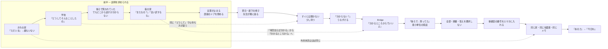

# 分かるところから

## Source Facts

- **Creator:** Kamo（高知県）
- **Source:** https://suno.com/song/343f47d2-59f5-434b-a823-7887e85c7392
- **Creator URL:** https://suno.com/@kondokazudeskkk
- **Collected at:** 2026-09-29T16:42:41.566Z
- **Published on page:** 2026年9月28日 23:00
- **Model shown on page:** V6
- **Duration shown on page:** 5:24
- **Play count at collection:** 56
- **Like count at collection:** 15
- **Comment count at collection:** 4

### Caption (raw)

```text
夕方。 「ただいま」と言っても、 家には誰もいない。 学校では、 教室を飛び出した理由を聞かれた。 でも、 うまく答えられなかった。 家でも言えない。 学校でも言えない。 次の日。 廊下で一人座っていると、 先生が隣に座った。 「どうして教室を出たの？」 「……分からない」 先生は少し待ってから言った。 「じゃあ、 分かるところからでいいよ」 しばらくして、 小さな声が出た。 「後ろで……笑ってた」 全部は話せなかった。 何も解決していない。 それでもその日、 話していい場所が、 ひとつできた。✨
```

### Style (raw)

```text
[no styles]
Variety Default
```

### Lyrics (raw)

```text
[Intro]

夕方

ろくじ よんじゅっぷん

玄関の鍵を

自分で開ける

「ただいま」

…………

誰もいない

靴を脱ぐ

冷蔵庫の音だけが

部屋の奥で

鳴っている

[Verse 1]

テーブルの上

千円札と

小さなメモ

「遅くなります

先に食べてて」

昨日も

同じ字だった

ランドセルを置く

学校でもらった

プリントが

少し曲がっている

今日

授業中に

教室を出た

先生に言われた

「勝手に出たら

だめでしょう」

「どうして

そんなことしたの」

…………

答えられなかった

[Pre-Chorus]

本当は

後ろの席で

笑われていた

昨日も

今日も

聞こえないふりを

していた

でも

それを

どこから話せばいいのか

分からなかった

[Chorus]

どうしてって

聞かれても

すぐには

言えないことがある

昨日からなのか

もっと前からなのか

自分でも

分からないことがある

だから

少しだけ

待ってほしい

怒る前に

答えを決める前に

「何があったの」って

もう一度だけ

聞いてほしい

[Verse 2]

夜

くじ じゅうにふん

玄関が開く

母さんが帰る

買い物袋

仕事の鞄

鳴っているスマホ

「ごめん

今日ほんと疲れた」

そのあと

父さんも帰る

ネクタイを緩めながら

「今月も

厳しいな」

テーブルの上の

学校からの連絡

母さんが読む

「またなの？」

父さんが言う

「何回言えば

分かるんだ」

僕は

下を向く

言おうとする

「でも……」

「言い訳するな」

そこで

言葉が

止まった

[Pre-Chorus 2]

母さんも

疲れている

父さんも

困っている

知っている

だから余計に

僕のことまで

困らせたくなくて

部屋のドアを

閉めた

[Chorus]

話したいのに

話せない夜がある

言葉にしたら

もっと怒られそうで

黙っていたら

「何を考えてるか

分からない」って言われる

じゃあ

どこで

話せばいいんだろう

誰なら

最後まで

聞いてくれるんだろう

[Verse 3]

次の日

昼休み

図書室の前

廊下の椅子に

一人で座っていた

通りかかった

保健室の先生が

三歩

通り過ぎて

戻ってきた

「ここ

座っていい？」

僕は

うなずく

先生は

隣に座った

すぐには

何も聞かなかった

チャイムが鳴る

遠くで

誰かが走ってる

しばらくして

先生が言った

「昨日

教室を出たんだって？」

僕は

また

下を向いた

「どうして？」

…………

言えない

先生は

少し待った

そして

「分からない？」

僕は

うなずいた

[Bridge]

「じゃあ

分かるところからで

いいよ」

…………

分かるところ

僕は

床を見たまま

考えた

「後ろで……」

声が

小さすぎて

消えそうになる

先生は

何も言わない

「後ろで

笑ってた」

初めて

そこまで

言えた

先生は

「うん」

それだけ言った

「昨日も？」

うなずく

「その前も？」

もう一度

うなずく

[Chorus]

全部

話せなくてもいい

順番が

ばらばらでもいい

昨日のことからでも

今朝のことからでも

一番

言いやすいところからでいい

答えが

まだなくても

「分からない」って

言っていい

話せる場所が

ひとつあるなら

そこから

ひとつずつ

言葉にしていけばいい

[Verse 4]

夕方

また

自分で鍵を開ける

「ただいま」

…………

今日も

誰もいない

冷蔵庫が

同じ音で鳴っている

テーブルには

同じようなメモ

何も

変わっていない

父さんの仕事も

母さんの仕事も

学校のことも

まだ

何も終わっていない

だけど

鞄を置いて

スマホを出す

今日

先生にもらった

小さな紙

保健室の番号

画面に

入れておく

[Final Chorus]

一人に見える夜にも

本当に

一人とは限らない

まだ会っていない人

まだ話していない人

「どうしたの」って

聞いてくれる人が

どこかに

いるかもしれない

すぐに

全部を話さなくていい

助けてって

上手に言えなくてもいい

「少し

聞いてほしい」

それだけでもいい

声にならなければ

書いてもいい

今日

言えなければ

明日でもいい

分かるところから

ひとつずつ

君の話を

君の速さで

[Outro]

夜

くじ じゅうさんぷん

玄関が開く

「ただいま」

母さんの声

僕は

部屋から出る

廊下で

少し止まる

まだ

全部は

言えない

でも

「あのさ」

母さんが

振り向く

…………

「今日ね」

そこまで

言えた
```

---

## Clean Lyrics

### [Intro]

夕方。ろくじ よんじゅっぷん。  
玄関の鍵を自分で開ける。

「ただいま」  
…………  
誰もいない。

靴を脱ぐ。  
冷蔵庫の音だけが、部屋の奥で鳴っている。

### [Verse 1]

テーブルの上、千円札と小さなメモ。  
「遅くなります　先に食べてて」  
昨日も同じ字だった。

ランドセルを置く。  
学校でもらったプリントが少し曲がっている。

今日、授業中に教室を出た。  
先生に言われた。

「勝手に出たらだめでしょう」  
「どうしてそんなことしたの」

…………  
答えられなかった。

### [Pre-Chorus]

本当は、後ろの席で笑われていた。  
昨日も今日も、聞こえないふりをしていた。

でも、それをどこから話せばいいのか分からなかった。

### [Chorus]

どうしてって聞かれても、すぐには言えないことがある。  
昨日からなのか、もっと前からなのか、自分でも分からないことがある。

だから、少しだけ待ってほしい。  
怒る前に、答えを決める前に、  
「何があったの」って、もう一度だけ聞いてほしい。

### [Verse 2]

夜。くじ じゅうにふん。  
玄関が開く。母さんが帰る。

買い物袋、仕事の鞄、鳴っているスマホ。  
「ごめん　今日ほんと疲れた」

そのあと父さんも帰る。  
ネクタイを緩めながら、  
「今月も厳しいな」

テーブルの上の学校からの連絡。  
母さんが読む。  
「またなの？」

父さんが言う。  
「何回言えば分かるんだ」

僕は下を向く。  
言おうとする。  
「でも……」

「言い訳するな」

そこで、言葉が止まった。

### [Pre-Chorus 2]

母さんも疲れている。  
父さんも困っている。  
知っている。

だから余計に、僕のことまで困らせたくなくて、部屋のドアを閉めた。

### [Chorus]

話したいのに話せない夜がある。  
言葉にしたらもっと怒られそうで、  
黙っていたら「何を考えてるか分からない」って言われる。

じゃあ、どこで話せばいいんだろう。  
誰なら最後まで聞いてくれるんだろう。

### [Verse 3]

次の日、昼休み。  
図書室の前、廊下の椅子に一人で座っていた。

通りかかった保健室の先生が、三歩通り過ぎて戻ってきた。

「ここ、座っていい？」

僕はうなずく。  
先生は隣に座った。  
すぐには何も聞かなかった。

しばらくして先生が言った。  
「昨日、教室を出たんだって？」

「どうして？」  
…………  
言えない。

先生は少し待った。  
そして、  
「分からない？」

僕はうなずいた。

### [Bridge]

「じゃあ、分かるところからでいいよ」

…………  
分かるところ。

「後ろで……」

声が小さすぎて、消えそうになる。  
先生は何も言わない。

「後ろで笑ってた」

初めて、そこまで言えた。

先生は「うん」。  
それだけ言った。

「昨日も？」  
うなずく。

「その前も？」  
もう一度、うなずく。

### [Chorus]

全部話せなくてもいい。  
順番がばらばらでもいい。

昨日のことからでも、今朝のことからでも、  
一番言いやすいところからでいい。

答えがまだなくても、  
「分からない」って言っていい。

話せる場所がひとつあるなら、  
そこからひとつずつ、言葉にしていけばいい。

### [Verse 4]

夕方。  
また自分で鍵を開ける。

「ただいま」  
…………  
今日も誰もいない。

冷蔵庫が同じ音で鳴っている。  
テーブルには同じようなメモ。

何も変わっていない。  
父さんの仕事も、母さんの仕事も、学校のことも、まだ何も終わっていない。

だけど、鞄を置いてスマホを出す。

今日、先生にもらった小さな紙。  
保健室の番号。  
画面に入れておく。

### [Final Chorus]

一人に見える夜にも、本当に一人とは限らない。

まだ会っていない人。  
まだ話していない人。  
「どうしたの」って聞いてくれる人が、どこかにいるかもしれない。

すぐに全部を話さなくていい。  
助けてって上手に言えなくてもいい。

「少し聞いてほしい」  
それだけでもいい。

声にならなければ、書いてもいい。  
今日言えなければ、明日でもいい。

分かるところから、ひとつずつ。  
君の話を、君の速さで。

### [Outro]

夜。くじ じゅうさんぷん。  
玄関が開く。

「ただいま」  
母さんの声。

僕は部屋から出る。  
廊下で少し止まる。

まだ全部は言えない。  
でも、

「あのさ」

母さんが振り向く。

…………  
「今日ね」

そこまで言えた。

---

## Lyrics Analysis

### Summary

教室を飛び出した理由をうまく説明できない子どもが、学校でも家庭でも「なぜ」「何回言えば分かる」と答えを求められ、言葉を止めていく物語。転換点は、保健室の先生がすぐに答えを要求せず、隣に座って待ち、「分かるところからでいい」と言う場面にある。問題そのものは解決しないまま、最後は「今日ね」と話し始めるところで終わる。作品が描く変化は、状況の解消ではなく、話せる関係と入口が一つできたことに置かれている。

### Themes

- すぐには言語化できない苦痛
- 問い詰めることと、待って聞くことの差
- 学校と家庭の双方で説明責任を負わされる子どもの孤立
- 「分からない」を認めること
- 全部を一度に話さず、言えるところから始めること
- 問題解決より前に「話していい場所」を作ること
- 大人側の疲労や事情を理解するほど、子どもが自分の苦痛を抑えてしまう構図

### Core Keywords

- 分からない
- 話す
- 聞く
- 待つ
- 言葉
- 一人
- 家
- 学校
- 先生
- 場所
- 速さ

### Symbols / Motifs

- **玄関の鍵 / 「ただいま」:** 帰宅の反復。IntroとVerse 4でほぼ同じ状況が繰り返され、外的状況が変わっていないことを示す。
- **冷蔵庫の音:** 誰もいない家の静けさを具体化する生活音。Verse 4で「同じ音」として再登場する。
- **メモ:** 両親の不在と生活の忙しさを示す具体物。二度目にも「同じようなメモ」が置かれ、家庭環境の継続を示す。
- **曲がったプリント / 学校からの連絡:** 子どもの出来事が大人の側では「問題行動の記録」として運ばれてくる媒介。
- **ドア:** Verse 2では「部屋のドアを閉めた」として会話を遮断する方向に働く。
- **廊下の椅子:** 教室でも家庭でもない中間地点。先生が隣に座ることで「話してよい場所」へ変わる。
- **三歩通り過ぎて戻る:** 先生が自動的に介入するのではなく、気づいて戻る小さな行動として描かれる。
- **小さな紙 / 保健室の番号:** 問題の解決ではなく、次に話せる経路を持ち帰る象徴。
- **「今日ね」:** 全部を語る代わりに、会話を始める最小単位。

### Perspective

一人称の「僕」を中心に進む具体的な時間順の物語。大人の言葉も直接話法で多く入り、同じ「どうして」「分からない」という語が、誰がどう言うかによって圧力にも許可にも変わる。両親については単純な悪役化をせず、「疲れている」「困っている」と僕自身が理解しているため、その理解が逆に沈黙を深める構造になっている。

### Narrative / Semantic Progression

1. 孤立した帰宅。「ただいま」に返事がなく、冷蔵庫の音だけがある。
2. 学校で教室を出た理由を求められるが答えられない。
3. 読者には「後ろの席で笑われていた」と示されるが、本人はどこから話すか分からない。
4. 家庭でも学校からの連絡を起点に説明が遮られ、言葉が止まる。
5. 「話したいのに話せない」「どこで／誰なら聞いてくれるか」という問いになる。
6. 保健室の先生は隣に座り、すぐには聞かない。
7. 「分からない？」という問いに、言葉ではなくうなずきで応答できる。
8. 「分かるところからでいいよ」を起点に、「後ろで笑ってた」まで言える。
9. 「分からない」こと自体を言ってよいものとして再定義する。
10. 家・仕事・学校は何も解決していないが、保健室の番号という経路を持ち帰る。
11. 最後に母へ「あのさ」「今日ね」と会話を始める。

### Repetition / Contrast / Notable Wording

- **「分からない」の意味反転:** 前半では答えられない状態、後半では「言っていい」出発点。
- **「どうして？」の対照:** 最初の先生の問いは叱責とセット。保健室の先生の問いには、その後の沈黙を待つ行動が続く。
- **「何回言えば分かるんだ」↔「分かるところからでいいよ」:** 「分かる」が、服従を求める語から本人の理解できている範囲を尊重する語へ反転する。
- **Intro ↔ Verse 4:** 「自分で鍵を開ける」「ただいま」「誰もいない」「冷蔵庫」「メモ」が反復される。二度目には保健室の番号が加わる。
- **解決しない終わり方:** 成功を「全部話せた」に置かず、「話し始められた」に置いている。

---

## Structure Analysis

- **Structure type:** `hybrid: linear_narrative + spiral_repetition + contrast_reversal`
- **Summary:** 時系列は夕方→夜→翌日昼→夕方→夜と直線的に進む一方、「どうして」「分からない」「ただいま」「誰もいない」といった語や場面が反復され、その意味が少しずつ変わる。特に「分かる」は、前半の「何回言えば分かるんだ」という圧力から、Bridgeの「分かるところからでいいよ」という受容へ反転する。終盤は冒頭と同じ家に戻るが、保健室の番号と「今日ね」という発話が加わり、同じ場所へ戻りながら関係だけが一段進む。

### Mermaid



### Structural Notes

- 物語は時刻表示を使って細かく進み、生活の連続性を強く出している。
- 前半では「学校」「家庭」の両方が説明を求める場所として並び、どちらでも言葉が止まる。
- Verse 3からBridgeにかけては、大きな事件ではなく「隣に座る」「待つ」「うなずく」「うんと言う」という小さな応答の連鎖で転換する。
- Verse 4はIntroの再演に近い。環境を変えず、主人公が「次に話せる経路」を持ったことだけを差分として見せる。
- Outroの「今日ね」は未完文で終わり、歌全体の主題である「全部を一度に話さなくていい」を形式そのものでも実行している。

---

## Suno Prompt Knowledge

### Style Raw

```text
[no styles]
Variety Default
```

### Directives Observed in Lyrics

| Directive | Position | Structural role | Source/Inference |
|---|---|---|---|
| `[Intro]` | opening | 一人で帰宅する生活場面を提示 | lyrics_raw / structural interpretation |
| `[Verse 1]` | first verse | 学校での出来事と説明要求を提示 | lyrics_raw / structural interpretation |
| `[Pre-Chorus]` | before chorus 1 | 本当の理由はあるが、どこから話すか分からないことを明示 | lyrics_raw / structural interpretation |
| `[Chorus]` | chorus 1 | すぐ答えられないこと、待ってほしいことを一般化 | lyrics_raw / structural interpretation |
| `[Verse 2]` | second verse | 家庭でも説明が遮られる状況を描く | lyrics_raw / structural interpretation |
| `[Pre-Chorus 2]` | before chorus 2 | 親の事情を理解することが沈黙を深める理由を提示 | lyrics_raw / structural interpretation |
| `[Chorus]` | chorus 2 | 「どこで／誰なら話せるか」という問いへ移る | lyrics_raw / structural interpretation |
| `[Verse 3]` | third verse | 待ってくれる聞き手の登場 | lyrics_raw / structural interpretation |
| `[Bridge]` | pivot | 「分かるところから」を起点に初めて具体的事実を話す | lyrics_raw / structural interpretation |
| `[Chorus]` | chorus 3 | 「分からない」を含めて、話し方の自由を肯定 | lyrics_raw / structural interpretation |
| `[Verse 4]` | return | 冒頭と同じ家へ戻し、外的状況は未解決と確認 | lyrics_raw / structural interpretation |
| `[Final Chorus]` | climax | 一人ではない可能性と、複数の伝え方・時間軸を提示 | lyrics_raw / structural interpretation |
| `[Outro]` | ending | 母への「今日ね」という会話の入口で閉じる | lyrics_raw / structural interpretation |

### Reusable Notes

- Style欄は `[no styles]` / `Variety Default` で、具体的なジャンル・楽器・ボーカル・展開指定はRawには存在しない。実際の音像やアレンジ結果は、この記録からは評価しない。
- 歌詞側ではセクションラベルだけで構造を明確に作り、特に `Verse 3 → Bridge → Chorus` が「聞き手の登場 → 最初の発話 → 原則の一般化」という役割分担になっている。
- 時刻、玄関、冷蔵庫、メモなどの生活ディテールを反復し、外的環境を変えずに意味の変化だけを示す設計は、現実的な物語歌詞の参照例になる。
- 同じ言葉の意味を、話者と応答の仕方で反転させる技法が強い。特に `分かる / 分からない` と `どうして` が構造上の軸になっている。
- 最終的な解決を描かず、「連絡先を保存する」「今日ねと言える」という小さな行動だけを進展として残すため、過度な解決感を避ける物語設計の例になる。

---

## Az Listening Notes

> No listening note yet.

### Raw Notes from Az

- 

### Structured Listening Tags

- **Perceived mood:**
- **Perceived instrumentation / texture:**
- **Energy change:**
- **Vocal impression:**
- **Favorite sonic moment:**
- **Useful reference for:**

> These fields must be based on Az's own listening notes. Do not infer them from audio files, Style, or lyrics alone.

---

## Az Impression

### Raw Notes from Az

> No Az note yet.

### Structured Impression

- **First impression:**
- **Favorite moment:**
- **Emotion words:**
- **Colors / scenery:**
- **Physical sensation:**
- **What felt unusual:**
- **Useful reference for:**

---

## Review Hooks

Points worth discussing when Az writes a review. These are prompts, not a finished review.

- 同じ「分かる」という語が、「何回言えば分かるんだ」という圧力から「分かるところからでいいよ」という許可へ反転すること。
- 「どうして？」という質問そのものより、その直後に相手が待つか、答えを決めつけるかが重要だと描いている点。
- 親を単純な悪役にせず、僕自身が「疲れている」「困っている」と理解しているため、その共感がかえって沈黙を深めていること。
- 保健室の先生の転換が、「正しい助言」ではなく「隣に座る」「すぐ聞かない」「うんと言う」という小さな行動で作られていること。
- Verse 4で家の状況をあえてほぼ変えず、問題解決ではなく「保健室の番号を持っている」という経路の増加を変化として置くこと。
- 最後を「全部話した」ではなく「今日ね」までに留め、歌詞の主張そのものを結末の形式で実行していること。

---

## Provenance / Confidence

- **Page-derived facts:** title, creator, creator_url, source_url, collected_at, published_at, model, duration, caption_raw, style_raw, lyrics_raw, play/like/comment counts at collection
- **AI text analysis:** Clean Lyrics, themes, keywords, motifs, perspective, semantic progression, structure classification, Mermaid, directive roles, reusable notes, review hooks
- **Az listening notes:** none yet
- **Az impression:** none yet
- **Unavailable / uncertain:** actual sound, arrangement, vocal delivery, instrumentation, and any author intent not explicitly present in the page text

### Audio Handling Policy

- Do not search for direct audio file URLs.
- Do not download or convert m4a/mp3/wav files.
- Do not perform automated audio analysis.
- Sound-related notes must come from Az's own listening comments.
