# 名前の増えた世界

## Source Facts

- **Creator:** けちねこ"neko"
- **Source:** https://suno.com/song/a524bbd7-d2a4-47f8-96e2-46c531d48e00
- **Creator URL:** https://suno.com/@kechineko
- **Collected at:** 2026-09-29T00:47:49+09:00
- **Published on page:** 2026年9月21日 10:20
- **Model shown on page:** V6
- **Duration shown on page:** 3:59

### Caption (raw)

```text
名前の増えた世界 A World with More Names #グッバイネクステ「Welcome Next Stage」参加曲。 Sunoを始めてもうすぐ半年。最初はただ作品を公開するだけだった場所が、少しずつ誰かの名前を覚え、音を待ち、言葉を交わす場所へ変わっていきました。 まだ完成ではないし、自分の色も変わり続ける。その途中にいる今を描いた曲です。 Created for “Welcome Next Stage” in #グッバイネクステ. Nearly six months after starting Suno, a place where I simply posted songs became a place of names, sounds, and connections. I’m still unfinished, and my color is still changing. This song captures that in-between moment as I move toward what comes next.
```

### Style (raw)

```text
Progressive Art Pop × Sophisti-Pop with an organic off-kilter groove, Verses in 5/4, choruses in 4/4, 96 BPM, Low-mid female alto: clear, dry, intimate, precise diction, restrained vibrato, emotionally alert, Rhodes electric piano, muted clean guitar, fretless melodic bass, rim-click drums, soft kick, vibraphone accents, sparse analog synth, Verse melody stays compact over asymmetric phrasing; pre-choruses smooth the meter transition, Choruses open through longer melodic arcs and interlocking counterlines, not volume, Let bass, guitar and vibraphone answer short vocal phrases like exchanged replies, Avoid repetitive four-chord writing; use suspended/add9 colors and subtle harmonic turns, Final chorus reharmonizes the main motif instead of simply getting bigger, Aim around 4:00, End with Rhodes and bass trading the opening figure, warm but open-ended, ‑6/8 meter, ‑waltz feel, ‑chamber pop, ‑folktronica, ‑orchestral string-led arrangement, ‑lone piano ballad intro, ‑straight 4/4 throughout, ‑generic four-chord loop, ‑cinematic power ballad, ‑anthemic chorus, ‑oversized emotional swell, ‑EDM build or drop, ‑heavy rock backbeat, ‑shouty belting, ‑excessive vocal layers, ‑vocal ad-libs, ‑spoken narration, ‑whisper, ‑humming, ‑breathy sleepy vocal
```

### Lyrics (raw)

```text
[Intro: 5/4, intimate low-mid female alto; Rhodes motif and warm bass only, dry and close]

ひとりで置いた音の先に
知らない返事が届いていた

[Verse 1: 5/4, compact conversational melody; muted guitar enters, restrained off-kilter groove]

最初はただ　作ることが嬉しくて
届く先まで　考えなかった
置いていくだけで　満たされていた
私ひとりで　音を鳴らしてた

[Pre-Chorus: Begin in 5/4, gradually smooth the phrasing toward 4/4; vibraphone answers the vocal]

それでもある日　名前を覚えて
次の音を　待つようになった

[Chorus: Shift clearly into 4/4; longer melodic arcs and interlocking instrumental replies, open but not louder]

名前の増えた世界で
まだ途中の私がいる
誰かの色に触れるたび
私の輪郭が見えてくる

My Own Color

[Post-Chorus: 4/4, pull back to Rhodes and melodic bass]

ひとりで置いた音の先に
いくつもの返事が届いてる

[Verse 2: Return to 5/4; more active bass and rim-click groove, flowing but never rap-like]

言葉を交わして　笑って迷って
知らなかった響きを受け取った
似ていない音に　心が動いて
違う色ほど　自分が見えてくる
出会った色を　なぞるんじゃなく
私の音へ　そっと溶かしていく

[Hook: Shift to 4/4; vocal phrase answered separately by bass, guitar and vibraphone]

ひとりで置いた音は今
誰かの音へ続いてる

[Instrumental Break: 8 bars; first half in 5/4, second half in 4/4. Pass one motif between Rhodes, fretless bass, muted guitar and vibraphone. No vocal.]

[Bridge: Begin sparse in 5/4; harmonic turns become less settled, then ease naturally toward 4/4]

まだ完成なんてしてなくて
答えはひとつじゃなくていい
昨日の私も　連れていく
余白の続きを　描いていく

[Final Chorus: 4/4, reharmonized main motif; richer counterlines but no power-climax or belting]

名前の増えた世界で
まだ知らない明日を描く
出会った色を抱えながら
変わり続ける　私のままで

My Own Color

[Only on the final “My Own Color”: one subtle supporting harmony]

[Post-Chorus: 4/4, gentle release; instruments thin out one by one]

ひとりで置いた音の先に
まだ知らない返事が待っている

[Outro: Instrumental only; Rhodes and fretless bass exchange the opening figure once, then leave the harmony open]


⬇️English

Beyond the sounds I left there on my own
Replies from strangers somehow reached me

At first, I was simply happy just to create
I never thought about where it might arrive
Leaving something behind was enough for me
I was making music in a world of my own

Then one day, I began remembering names
And started waiting for the next sound to come

In a world where more names have appeared
Here I am, still somewhere along the way
Every time I encounter someone else’s colors
The outline of who I am comes into view

My Own Color

Beyond the sounds I left there on my own
So many replies are reaching me now

We traded words, we laughed, we lost our way
I received sounds I had never known before
I found myself moved by voices unlike mine
The more different the colors, the more I see myself
Not tracing over the colors that I found
But gently blending them into my own sound

The sounds I once left there on my own
Are now connected to somebody else’s

I am still nowhere near complete
There does not have to be only one answer
I will take yesterday’s version of me along
And keep drawing into the space still left

In a world where more names have appeared
I draw a tomorrow I have yet to know
Holding all the colors I have encountered
I will keep changing, while remaining myself

My Own Color

Beyond the sounds I left there on my own
Replies I have yet to know are waiting there
```

---

## Clean Lyrics

### 日本語

[Intro]

ひとりで置いた音の先に
知らない返事が届いていた

[Verse 1]

最初はただ　作ることが嬉しくて
届く先まで　考えなかった
置いていくだけで　満たされていた
私ひとりで　音を鳴らしてた

[Pre-Chorus]

それでもある日　名前を覚えて
次の音を　待つようになった

[Chorus]

名前の増えた世界で
まだ途中の私がいる
誰かの色に触れるたび
私の輪郭が見えてくる

My Own Color

[Post-Chorus]

ひとりで置いた音の先に
いくつもの返事が届いてる

[Verse 2]

言葉を交わして　笑って迷って
知らなかった響きを受け取った
似ていない音に　心が動いて
違う色ほど　自分が見えてくる
出会った色を　なぞるんじゃなく
私の音へ　そっと溶かしていく

[Hook]

ひとりで置いた音は今
誰かの音へ続いてる

[Instrumental Break]

[Bridge]

まだ完成なんてしてなくて
答えはひとつじゃなくていい
昨日の私も　連れていく
余白の続きを　描いていく

[Final Chorus]

名前の増えた世界で
まだ知らない明日を描く
出会った色を抱えながら
変わり続ける　私のままで

My Own Color

[Post-Chorus]

ひとりで置いた音の先に
まだ知らない返事が待っている

[Outro]

### English（公開ページ掲載訳）

Beyond the sounds I left there on my own
Replies from strangers somehow reached me

At first, I was simply happy just to create
I never thought about where it might arrive
Leaving something behind was enough for me
I was making music in a world of my own

Then one day, I began remembering names
And started waiting for the next sound to come

In a world where more names have appeared
Here I am, still somewhere along the way
Every time I encounter someone else’s colors
The outline of who I am comes into view

My Own Color

Beyond the sounds I left there on my own
So many replies are reaching me now

We traded words, we laughed, we lost our way
I received sounds I had never known before
I found myself moved by voices unlike mine
The more different the colors, the more I see myself
Not tracing over the colors that I found
But gently blending them into my own sound

The sounds I once left there on my own
Are now connected to somebody else’s

I am still nowhere near complete
There does not have to be only one answer
I will take yesterday’s version of me along
And keep drawing into the space still left

In a world where more names have appeared
I draw a tomorrow I have yet to know
Holding all the colors I have encountered
I will keep changing, while remaining myself

My Own Color

Beyond the sounds I left there on my own
Replies I have yet to know are waiting there

---

## Lyrics Analysis

### Summary

自分一人の満足から始まった創作が、作品への「返事」と他の作り手の「名前」を得ることで、交流と自己発見の場へ変わっていく過程を描く。違う色に触れるほど自分の輪郭が見え、影響をそのままなぞるのではなく自分の音へ溶かしていく。終盤では未完成であることを欠点ではなく、昨日の自分を連れて余白を描き続けるための開かれた状態として肯定する。

### Themes

- 創作を通じた孤独から接続への移行
- 他者との差異を鏡にした自己認識
- 影響を受けながら固有性を保つこと
- 未完成・変化・継続の肯定
- 作品を介して続いていく応答

### Core Keywords

- 名前
- 音
- 返事
- 色
- 輪郭
- 途中
- 余白
- 明日

### Symbols / Motifs

- **名前:** 匿名だった外部が、記憶される関係へ変わったことの印。
- **音:** 作品そのものと、作り手同士を結ぶ媒体の両方を担う。
- **返事:** 一方通行の公開が相互作用へ変わった証拠。冒頭の「知らない」から終幕の「まだ知らない」へ意味が変わる。
- **色:** 他者の個性と自分の個性。模倣ではなく混ざり合いによる更新を示す。
- **輪郭:** 他者との違いによって可視化される自己像。
- **余白:** 未完成さではなく、これから描ける可能性。

### Perspective

一人称の「私」が、Sunoでの創作経験を現在から振り返りながら語る。視点は「私ひとり」から「誰か」「名前」「いくつもの返事」へ広がり、最終的に他者を抱えたまま変わり続ける自己へ着地する。

### Repetition / Contrast / Notable Wording

- 「ひとりで置いた音の先に」が、Intro・Post-Chorus・終盤のPost-Chorusで反復される。返事は「知らない返事が届いていた」→「いくつもの返事が届いてる」→「まだ知らない返事が待っている」と、過去の驚き・現在の実感・未来への期待へ変化する。
- 「私ひとりで」と「誰かの音へ」、「置いていく」と「続いてる」が、一方向から接続への転換を作る。
- 「違う色ほど　自分が見えてくる」は、差異を隔たりでなく自己認識の契機として扱う中心行。
- 「なぞるんじゃなく／私の音へ　そっと溶かしていく」は、影響と模倣の違いを明確にする。
- 「変わり続ける　私のままで」は、変化と同一性を対立させず同居させる逆説的な結論。

---

## Structure Analysis

- **Structure type:** parallel_evolution + spiral_repetition
- **Summary:** 同じ「ひとりで置いた音の先に」へ繰り返し戻りながら、返事の意味が未知の到来から複数のつながり、さらに未来の可能性へ段階的に変わる。同時に、Verseの5/4とChorusの4/4という明示的な設計が、内省的な自己領域と他者へ開く場面を交互に配置する。

### Mermaid

```mermaid
flowchart LR
    I[Intro<br/>知らない返事が届く] --> V1[Verse 1<br/>ひとりで作る満足]
    V1 --> P[Pre-Chorus<br/>名前を覚え、次の音を待つ]
    P --> C1[Chorus<br/>他者の色から自分の輪郭へ]
    C1 --> PC1[Post-Chorus<br/>いくつもの返事]
    PC1 --> V2[Verse 2<br/>違う色を自分の音へ溶かす]
    V2 --> H[Hook<br/>自分の音が誰かへ続く]
    H --> IB[Instrumental Break<br/>5/4から4/4へ]
    IB --> B[Bridge<br/>未完成と余白を肯定]
    B --> FC[Final Chorus<br/>変わり続ける私]
    FC --> PC2[Post-Chorus<br/>まだ知らない返事を待つ]
    PC2 --> O[Outro<br/>開かれた終わり]

    classDef inward fill:#eef2ff,stroke:#6366f1,color:#1e1b4b;
    classDef outward fill:#ecfdf5,stroke:#10b981,color:#064e3b;
    class V1,V2,B inward;
    class C1,PC1,H,FC,PC2 outward;
```



### Structural Notes

- Introと2回のPost-Chorusが同一の文型を受け持ち、曲全体を螺旋状に束ねる。
- 1番は「名前を覚える」ことで他者の存在が具体化し、2番は「色を溶かす」ことで他者の影響を自己表現へ統合する。
- Bridgeは「答えはひとつじゃなくていい」「余白の続きを描く」で、自己の未完成さを将来の自由へ反転する。
- Final Chorusは初回Chorusの「輪郭が見えてくる」から、「出会った色を抱えながら／変わり続ける」へ進み、自己発見から自己更新へ意味を進める。
- StyleとLyrics Directiveでは、Verseを5/4、Chorusを4/4とし、Pre-ChorusとInstrumental Breakを拍子移行の橋にする設計が明示されている。

---

## Suno Prompt Knowledge

### Style Raw

```text
Progressive Art Pop × Sophisti-Pop with an organic off-kilter groove, Verses in 5/4, choruses in 4/4, 96 BPM, Low-mid female alto: clear, dry, intimate, precise diction, restrained vibrato, emotionally alert, Rhodes electric piano, muted clean guitar, fretless melodic bass, rim-click drums, soft kick, vibraphone accents, sparse analog synth, Verse melody stays compact over asymmetric phrasing; pre-choruses smooth the meter transition, Choruses open through longer melodic arcs and interlocking counterlines, not volume, Let bass, guitar and vibraphone answer short vocal phrases like exchanged replies, Avoid repetitive four-chord writing; use suspended/add9 colors and subtle harmonic turns, Final chorus reharmonizes the main motif instead of simply getting bigger, Aim around 4:00, End with Rhodes and bass trading the opening figure, warm but open-ended, ‑6/8 meter, ‑waltz feel, ‑chamber pop, ‑folktronica, ‑orchestral string-led arrangement, ‑lone piano ballad intro, ‑straight 4/4 throughout, ‑generic four-chord loop, ‑cinematic power ballad, ‑anthemic chorus, ‑oversized emotional swell, ‑EDM build or drop, ‑heavy rock backbeat, ‑shouty belting, ‑excessive vocal layers, ‑vocal ad-libs, ‑spoken narration, ‑whisper, ‑humming, ‑breathy sleepy vocal
```

### Directives Observed in Lyrics

| Directive | Position | Structural role | Source/Inference |
|---|---|---|---|
| `[Intro: 5/4, intimate low-mid female alto; Rhodes motif and warm bass only, dry and close]` | Intro | 5/4と限定編成で、孤独な起点を設定 | Page-derived directive; role is AI text analysis |
| `[Verse 1: 5/4, compact conversational melody; muted guitar enters, restrained off-kilter groove]` | Verse 1 | 5/4の非対称感を保ちつつ語りを進める | Page-derived directive; role is AI text analysis |
| `[Pre-Chorus: Begin in 5/4, gradually smooth the phrasing toward 4/4; vibraphone answers the vocal]` | Pre-Chorus | 5/4から4/4への移行を言語化 | Page-derived directive; role is AI text analysis |
| `[Chorus: Shift clearly into 4/4; longer melodic arcs and interlocking instrumental replies, open but not louder]` | Chorus | 音量ではなくフレーズ長と応答で開放感を作る意図 | Page-derived directive; role is AI text analysis |
| `[Post-Chorus: 4/4, pull back to Rhodes and melodic bass]` | Post-Chorus 1 | サビ後に編成を引き、反復句へ焦点を戻す意図 | Page-derived directive; role is AI text analysis |
| `[Verse 2: Return to 5/4; more active bass and rim-click groove, flowing but never rap-like]` | Verse 2 | 5/4へ戻しつつ1番との差を付ける意図 | Page-derived directive; role is AI text analysis |
| `[Hook: Shift to 4/4; vocal phrase answered separately by bass, guitar and vibraphone]` | Hook | 歌と各楽器の個別応答で「つながり」を構造化 | Page-derived directive; role is AI text analysis |
| `[Instrumental Break: 8 bars; first half in 5/4, second half in 4/4. Pass one motif between Rhodes, fretless bass, muted guitar and vibraphone. No vocal.]` | Instrumental Break | モチーフ受け渡しと拍子移行を器楽で示す意図 | Page-derived directive; role is AI text analysis |
| `[Bridge: Begin sparse in 5/4; harmonic turns become less settled, then ease naturally toward 4/4]` | Bridge | 未完成さを扱う歌詞と不安定化を対応させ、Final Chorusへ接続 | Page-derived directive; role is AI text analysis |
| `[Final Chorus: 4/4, reharmonized main motif; richer counterlines but no power-climax or belting]` | Final Chorus | 音量増大ではなく再和声化と対旋律で意味変化を作る意図 | Page-derived directive; role is AI text analysis |
| `[Only on the final “My Own Color”: one subtle supporting harmony]` | Final Chorus直後 | 最後の英語フックだけを限定的に強調 | Page-derived directive; role is AI text analysis |
| `[Post-Chorus: 4/4, gentle release; instruments thin out one by one]` | Post-Chorus 2 | 未来へ開いた結びへ向けて段階的に余白を作る意図 | Page-derived directive; role is AI text analysis |
| `[Outro: Instrumental only; Rhodes and fretless bass exchange the opening figure once, then leave the harmony open]` | Outro | 冒頭モチーフを回収しつつ、完結しすぎない終わりを指定 | Page-derived directive; role is AI text analysis |

### Reusable Notes

- VerseとChorusで拍子を分け、Pre-ChorusやBreakに移行方法まで記述すると、歌詞の内向／外向の変化を構造へ対応させやすい。
- 「open but not louder」「instead of simply getting bigger」のように、避けたい常套的な盛り上げ方と代替手段を同時に書く設計が明確。
- 短い歌唱句へbass / guitar / vibraphoneが返答する指定は、歌詞テーマの「返事」をアレンジの役割へ翻訳する方法として再利用できる。
- Final Chorusを単純な音量増大ではなく、主題の再和声化と対旋律で変化させる指定は、意味の成熟を音楽構造で表す狙いに使える。
- Outroに冒頭モチーフの受け渡しとopen harmonyを指定することで、「完結ではなく継続」という歌詞の結論と形を合わせている。
- 上記はStyle / Lyrics Directiveのテキスト設計に関する知見であり、実際の音響結果についての評価ではない。

---

## Az Listening Notes

> No listening note yet.

### Raw Notes from Az

- 未提供

### Structured Listening Tags

- **Perceived mood:** 未提供
- **Perceived instrumentation / texture:** 未提供
- **Energy change:** 未提供
- **Vocal impression:** 未提供
- **Favorite sonic moment:** 未提供
- **Useful reference for:** 未提供

> These fields must be based on Az's own listening notes. Do not infer them from audio files, Style, or lyrics alone.

---

## Az Impression

### Raw Notes from Az

> No Az note yet.

### Structured Impression

- **First impression:** 未提供
- **Favorite moment:** 未提供
- **Emotion words:** 未提供
- **Colors / scenery:** 未提供
- **Physical sensation:** 未提供
- **What felt unusual:** 未提供
- **Useful reference for:** 未提供

---

## Review Hooks

Points worth discussing when Az writes a review. These are prompts, not a finished review.

- 冒頭と終盤で「知らない返事」が、偶然届いたものから未来に待つものへ変わる点。
- 「違う色ほど　自分が見えてくる」が、他者との違いを自己否定ではなく輪郭の発見へ変える点。
- 「なぞるんじゃなく／そっと溶かしていく」に表れる、影響と模倣の距離感。
- 初回Chorusの「輪郭が見えてくる」とFinal Chorusの「変わり続ける　私のままで」の対応。
- 歌詞の「返事」を、Style / Directive上では楽器同士の応答へ翻訳している設計。
- 未完成を「余白」と呼び換え、結論を閉じずに次の創作へ接続する終わり方。

---

## Provenance / Confidence

Clearly distinguish facts from interpretation.

- **Page-derived facts:** 曲名、作者、作者URL、Suno URL、Caption、Style、Lyrics、公開日時、V6表記、3:59の表示。
- **AI text analysis:** 歌詞要約、主題、キーワード、モチーフ、視点、反復と対照、構造分類、Directiveの構造的役割、再利用ノート、レビュー観点。
- **Az listening notes:** 未提供。
- **Az impression:** 未提供。
- **Unavailable / uncertain:** 実際の音響上の実現度、演奏・歌唱・ミックスの聴感評価。音源ファイルの取得や自動音響解析は行っていない。

### Audio Handling Policy

- Do not search for direct audio file URLs.
- Do not download or convert m4a/mp3/wav files.
- Do not perform automated audio analysis.
- Sound-related notes must come from Az's own listening comments.
