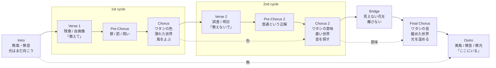

# 蒼い世界とワタシ | The Blue World and Me.

## Source Facts

- **Creator:** NacchaN
- **Source:** https://suno.com/song/2d7ea9ef-2820-4393-ac87-3769a891f22b
- **Creator URL:** https://suno.com/@nacchan_
- **Collected at:** 2026-09-29T02:02:45+09:00
- **Published on page:** 2026年9月27日 5:13
- **Model shown on page:** V6
- **Duration shown on page:** 4:17
- **Play count shown on page:** 351

### Caption (raw)

```text
蒼い世界でも、探している。 Even in the blue world, I’m still searching.
```

### Style (raw)

```text
Electronic pop with layered synthesizers and sparse piano, intimate female vocals with delicate breathy phrasing, sidechain-compressed pads and a half-time synth-pop sway.
```

### Lyrics (raw)

```text
[Instrumental: solo piano]

[Intro]
ワタシ…
静かな夜
風は無風
音は無音
光は…
まだ向こう…uh

[Verse 1]
残像の階段
ふと振り返る
歪んだ自画像
瞼の中は
シズク…
その理由…
ねぇ…
教えて…uh

[Pre-Chorus]
不思議な溜息
謎めく罰に
罪を認めたと…
し・た・ら？…

[Chorus]
消えないで
消さないで
ワタシの色
不揃いなまま
不器用なまま
置いてきた…
過去の存在？
でも、それが…ワタシ
薄れた世界の端
今、風をよんでいる…huhu

[Verse 2]
時の残酷差
後悔の誤差
現実の微差
明日…？らしく
なるさ…
その理由…
ねぇ…
教えないで…uh

[Pre-Chorus 2]
普通である正解
届かない日々
静かに離れたと…
し・て・も…uh

[Chorus 2]
消えないで
消さないで
ワタシの意味
空白のまま
掴めないまま
置いていく
無意味な存在？
でも、消えはしない
蒼い世界の端で
今、音を探してる…huhu

[Bridge]
遠く叶わないもの
指で謎って…？見る
見えない花でも
この手から離さない…

[Final Chorus]
消えないで
消さないで
ワタシの音
届かないまま
揺らぎ…ながら
散り咲いていく
消えかけの存在？
でも、息はしてる
醒めた世界の端
今、光を温めてる…uh

[Outro]
風は美風（びふう）…
音は微音（びおん）…
光は微光（びこう）…
ワタシは
今、世界の端に…
いる…uh

[Instrumental: solo piano]
```

---

## Clean Lyrics

### [Intro]

ワタシ…  
静かな夜。  
風は無風、音は無音。  
光は…まだ向こう…uh

### [Verse 1]

残像の階段、ふと振り返る。  
歪んだ自画像。  
瞼の中はシズク…  
その理由…ねぇ…教えて…uh

### [Pre-Chorus]

不思議な溜息。  
謎めく罰に、罪を認めたと…し・た・ら？…

### [Chorus]

消えないで、消さないで。  
ワタシの色。

不揃いなまま、不器用なまま。  
置いてきた…過去の存在？  
でも、それが…ワタシ。

薄れた世界の端。  
今、風をよんでいる…huhu

### [Verse 2]

時の残酷差、後悔の誤差、現実の微差。  
明日…？らしく、なるさ…  
その理由…ねぇ…教えないで…uh

### [Pre-Chorus 2]

普通である正解。  
届かない日々。  
静かに離れたと…し・て・も…uh

### [Chorus 2]

消えないで、消さないで。  
ワタシの意味。

空白のまま、掴めないまま。  
置いていく。  
無意味な存在？  
でも、消えはしない。

蒼い世界の端で、  
今、音を探してる…huhu

### [Bridge]

遠く叶わないもの。  
指で謎って…？見る。  
見えない花でも、この手から離さない…

### [Final Chorus]

消えないで、消さないで。  
ワタシの音。

届かないまま、揺らぎ…ながら、散り咲いていく。  
消えかけの存在？  
でも、息はしてる。

醒めた世界の端。  
今、光を温めてる…uh

### [Outro]

風は美風（びふう）…  
音は微音（びおん）…  
光は微光（びこう）…

ワタシは、  
今、世界の端に…いる…uh

---

## Lyrics Analysis

### Summary

「消えないで / 消さないで」という同じ呼びかけを軸に、自己を示す言葉が「色」→「意味」→「音」へ変化していく。最初は過去の自分を振り返り、次に空白や無意味さを抱え、最後には「消えかけ」ながらも「息はしてる」と存在そのものを確かめる。世界も「薄れた」→「蒼い」→「醒めた」と変化し、外界と自己の輪郭が同時に少しずつ変わる構造になっている。

### Themes

- 消えそうな自己の存在確認
- 不完全・不器用なままの自己受容
- 過去を消去せず、自分の一部として持ち続けること
- 正解や意味を掴めない状態でも進むこと
- 色・意味・音・光による自己像の変化

### Core Keywords

- ワタシ
- 消えないで / 消さないで
- 色
- 意味
- 音
- 光
- 世界の端
- 残像
- 揺らぎ

### Symbols / Motifs

- **世界の端:** 中心から外れた孤独な位置でありながら、探索が続いている場所。
- **色:** 最初の自己同一性。整っていなくても「それがワタシ」と認める対象。
- **意味:** 他者や社会から与えられる正解に近い概念。掴めなくても存在は消えない。
- **音:** 最終段階で自己を表すもの。意味よりも直接的で、揺らぎながらも外へ出ていく。
- **光:** 到達点そのものではなく、「まだ向こう」から最後には「温めてる」対象へ変化する。
- **風:** Introでは無風、1st Chorusでは呼び、Outroでは美風へ変化し、停滞から微かな流れへの移行を示す。

### Perspective

一人称の「ワタシ」が、自分自身を対象化して見つめている。問いかけの相手は明示されず、「教えて」から「教えないで」へ変化することで、外から答えを求める姿勢から、自分のまま進む姿勢へ少しずつ移っている。

### Narrative / Semantic Progression

1. **Intro:** 無風・無音・遠い光。静止した世界。
2. **Verse 1:** 過去と歪んだ自己像を振り返り、理由を外に求める。
3. **Chorus 1:** 「色」を消さないでと願い、不完全な過去も自分だと認める。
4. **Verse 2 / Chorus 2:** 正解や意味が掴めなくても、存在そのものは消えないと確認する。
5. **Bridge:** 見えないものを手放さない意思が現れる。
6. **Final Chorus:** 自己表現が「音」へ移り、消えかけでも「息はしてる」と身体的な存在確認へ到達。
7. **Outro:** 風・音・光が完全なものではなく「微かなもの」として現れ、自分も世界の端に「いる」と言い切る。

### Repetition / Contrast / Notable Wording

- 「消えないで / 消さないで」が3つのChorusで反復される一方、目的語が `色 → 意味 → 音` と変わる。
- `薄れた世界 → 蒼い世界 → 醒めた世界` と世界側の形容も対応して変化する。
- Verse 1の「教えて」に対しVerse 2では「教えないで」と反転する。
- Introの `無風 / 無音 / 光はまだ向こう` に対しOutroでは `美風 / 微音 / 微光` が現れる。ゼロから微かな存在への変化が特徴的。
- 「不揃い」「不器用」「空白」「掴めない」「揺らぎ」と、完成・確定を避ける語が連続している。

---

## Structure Analysis

- **Structure type:** `parallel_evolution + spiral_repetition`
- **Summary:** Verse / Pre-Chorus / Chorusの器を反復しながら、各Chorusで自己を示す語と世界の状態が段階的に変化する。最終的に「意味があるか」ではなく「息をしている / ここにいる」へ着地するため、同じ場所に戻りつつ意味が一段ずつ進む螺旋型の構造。

### Mermaid



### Structural Notes

- Chorusの形を維持したまま、`色 → 意味 → 音` が置き換わる。
- 「世界の端」という場所は変わらないが、その世界の状態が `薄れた → 蒼い → 醒めた` と推移する。
- OutroはIntroの鏡像に近く、`無風 / 無音 / 遠い光` が `美風 / 微音 / 微光` に変わることで、完全な解決ではなく「微かな回復」を示す。

---

## Suno Prompt Knowledge

### Style Raw

```text
Electronic pop with layered synthesizers and sparse piano, intimate female vocals with delicate breathy phrasing, sidechain-compressed pads and a half-time synth-pop sway.
```

### Directives Observed in Lyrics

| Directive | Position | Structural role | Source/Inference |
|---|---|---|---|
| `[Instrumental: solo piano]` | Opening | 本編前に歌なしのピアノ区間を置く指定 | Page-derived directive |
| `[Intro]` | Opening | 静止した世界観と基準状態の提示 | Section label + AI structural interpretation |
| `[Verse 1]` | First cycle | 過去・自己像・問いの提示 | Section label + AI structural interpretation |
| `[Pre-Chorus]` | First cycle | Chorus前の緊張・問いの集約 | Section label + AI structural interpretation |
| `[Chorus]` | First cycle | 「色」を軸にした自己確認 | Section label + AI structural interpretation |
| `[Verse 2]` | Second cycle | 誤差・正解からの離脱 | Section label + AI structural interpretation |
| `[Pre-Chorus 2]` | Second cycle | 「普通である正解」への距離化 | Section label + AI structural interpretation |
| `[Chorus 2]` | Second cycle | 「意味」を軸にした存在確認 | Section label + AI structural interpretation |
| `[Bridge]` | Before final chorus | 「見えない花を離さない」という意志の明示 | Section label + AI structural interpretation |
| `[Final Chorus]` | Climax | 「音」と「息」を軸にした自己存在の確定 | Section label + AI structural interpretation |
| `[Outro]` | Ending | Introの無状態を微かな風・音・光へ反転 | Section label + AI structural interpretation |
| `[Instrumental: solo piano]` | Ending | 歌後にもピアノだけの区間を置き、冒頭と対応させる指定 | Page-derived directive |

### Reusable Notes

- 同一Chorus文型でキーワードだけを `色 → 意味 → 音` と変えることで、歌詞の成長を強く見せられる実例。
- Intro / Outroで `無風・無音` と `美風・微音・微光` を対応させるように、冒頭と終幕で同じ語彙群を変形させる方法が有効。
- Styleでは `sparse piano` と `layered synthesizers`、さらに `half-time synth-pop sway` を同居させており、静かなピアノと電子的な揺れを両立させる設計例として参照できる。
- `intimate female vocals with delicate breathy phrasing` はボーカル設計上の明示指定。実際にどの程度そう鳴ったかはAz Listening Notesなしでは断定しない。

---

## Az Listening Notes

> No listening note yet.

### Raw Notes from Az

- 

### Structured Listening Tags

- **Perceived mood:**
- **Perceived instrumentation / texture:**
- **Energy change:**
- **Vocal impression:**
- **Favorite sonic moment:**
- **Useful reference for:**

> These fields must be based on Az's own listening notes. Do not infer them from audio files, Style, or lyrics alone.

---

## Az Impression

### Raw Notes from Az

> No Az note yet.

### Structured Impression

- **First impression:**
- **Favorite moment:**
- **Emotion words:**
- **Colors / scenery:**
- **Physical sensation:**
- **What felt unusual:**
- **Useful reference for:**

---

## Review Hooks

Points worth discussing when Az writes a review. These are prompts, not a finished review.

- `色 → 意味 → 音` と、Chorusごとに「ワタシ」を表す言葉が変わる点。
- `教えて → 教えないで` の反転で、外から答えを求める姿勢が変わる点。
- `無風 / 無音` から `美風 / 微音 / 微光` へ、ゼロではなく「微かな存在」に着地するOutro。
- 「意味がある」ではなく「息はしてる」「ここにいる」で自己を肯定する終盤。
- Intro / Outroをsolo pianoで挟むDirectiveと、歌詞上の対称構造の対応。

---

## Provenance / Confidence

- **Page-derived facts:** title / creator / URLs / published date / model / duration / caption / style / raw lyrics / play count
- **AI text analysis:** Clean Lyrics / themes / motifs / semantic progression / structure classification / Mermaid / reusable notes
- **Az listening notes:** none yet
- **Az impression:** none yet
- **Unavailable / uncertain:** 実際の音響効果・ボーカル質感・Style指定の実現度は未評価

### Audio Handling Policy

- Do not search for direct audio file URLs.
- Do not download or convert m4a/mp3/wav files.
- Do not perform automated audio analysis.
- Sound-related notes must come from Az's own listening comments.
