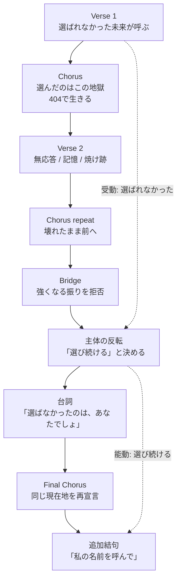

# 選ばれなかった未来

## Source Facts

- **Creator:** wiNK296
- **Source:** https://suno.com/song/701a664e-4c54-47a5-87d9-984cb447e347
- **Creator URL:** https://suno.com/@k7a7t7u
- **Collected at:** 2026-10-04T13:42:11.605Z
- **Published on page:** 2026年10月4日 18:57
- **Model shown on page:** V6-WILD
- **Duration shown on page:** 4:11
- **Play count shown on page:** 46

### Caption (raw)

```text
選ばなかったのは、あなたでしょ…
```

### Style (raw)

```text
Boost > Cyberpunk Synthpop | Dark Electro Pop | BPM 165 | Expressive High Energy Female Vocal | Dopagaki Staccato Chipping Synth | Ultra Heavy Sub Bass Drop | Extreme Low End Punch | Aggressive Sidechain Compression → Dark synthwave intro → Rapid dopagaki lead buildup → Massive sub bass drop → Explosive female chorus | - Hardcore | - Gabber | - male vocal | - weak vocal | - quiet bass | - acoustic drums
```

### Lyrics (raw)

```text
選ばれなかった未来が
ポケットの奥で眠ってる
曲がり角のすぐ向こうで
名前だけがまだ呼んでる

夜明け前の静かな改札
片方だけが光る靴
戻れないと分かっていても
足は前に踏み出すの

逃げ道なんてどこにもない
それでも息を吸い込むの
傷だらけになった手で
まだ何かを掴み取る

選ばれなかった未来
選んだのはこの地獄
エラー ヨン・マル・ヨンの場所で
私はここで生きるの

選ばれなかった未来
胸の奥で消えないまま
壊れた身体のままで
ただ前へと進むだけ！

(エラー ヨン・マル・ヨン…)

白い壁に囲まれた部屋
時計の針だけが響く
返事のない冷たい画面
送った言葉が揺れている

あの日の小さなやさしさも
いまは鋭い刃のようで
抱きしめた記憶の深さ分
深く深く刺さってくる

正しさなんて遠すぎる
でも目は絶対にそらさない
焼け跡の残る街にも
残酷に朝は来てしまう

選ばれなかった未来
選んだのはこの地獄
エラー ヨン・マル・ヨンの場所で
私はここで生きるの

選ばれなかった未来
胸の奥で消えないまま
壊れた身体のままで
ただ前へと進むだけ！

もう二度と戻れないなら…
この痛みを抱えて立つ…
傷つくたび強くなるとか
そんな振りじゃなくて…

選ばれなくても構わない
選び続けると決めたの
この手でこの長い夜を
完全に終わらせるまで…

「選ばなかったのは、あなたでしょ…」

「エラー ヨン・マル・ヨン!!」

選ばれなかった未来
選んだのはこの地獄
エラー ヨン・マル・ヨンの場所で
私はここで生きるの

選ばれなかった未来
胸の奥で消えないまま
壊れた身体のままで
ただ前へと進むだけ！

選ばれなかった未来
それでも前へと行く
エラー ヨン・マル・ヨンの場所で
私の名前を呼んで…
```

---

## Clean Lyrics

### [Verse 1]
選ばれなかった未来が、ポケットの奥で眠ってる。  
曲がり角のすぐ向こうで、名前だけがまだ呼んでる。

夜明け前の静かな改札。  
片方だけが光る靴。  
戻れないと分かっていても、足は前に踏み出すの。

逃げ道なんてどこにもない。  
それでも息を吸い込むの。  
傷だらけになった手で、まだ何かを掴み取る。

### [Chorus]
選ばれなかった未来。  
選んだのはこの地獄。  
エラー ヨン・マル・ヨンの場所で、私はここで生きるの。

選ばれなかった未来。  
胸の奥で消えないまま。  
壊れた身体のままで、ただ前へと進むだけ！

（エラー ヨン・マル・ヨン…）

### [Verse 2]
白い壁に囲まれた部屋。  
時計の針だけが響く。  
返事のない冷たい画面。  
送った言葉が揺れている。

あの日の小さなやさしさも、いまは鋭い刃のようで。  
抱きしめた記憶の深さ分、深く深く刺さってくる。

正しさなんて遠すぎる。  
でも目は絶対にそらさない。  
焼け跡の残る街にも、残酷に朝は来てしまう。

### [Chorus]
選ばれなかった未来。  
選んだのはこの地獄。  
エラー ヨン・マル・ヨンの場所で、私はここで生きるの。

選ばれなかった未来。  
胸の奥で消えないまま。  
壊れた身体のままで、ただ前へと進むだけ！

### [Bridge]
もう二度と戻れないなら…  
この痛みを抱えて立つ…  
傷つくたび強くなるとか、そんな振りじゃなくて…

選ばれなくても構わない。  
選び続けると決めたの。  
この手でこの長い夜を、完全に終わらせるまで…

「選ばなかったのは、あなたでしょ…」

「エラー ヨン・マル・ヨン!!」

### [Final Chorus]
選ばれなかった未来。  
選んだのはこの地獄。  
エラー ヨン・マル・ヨンの場所で、私はここで生きるの。

選ばれなかった未来。  
胸の奥で消えないまま。  
壊れた身体のままで、ただ前へと進むだけ！

選ばれなかった未来。  
それでも前へと行く。  
エラー ヨン・マル・ヨンの場所で、私の名前を呼んで…

---

## Lyrics Analysis

### Summary

「選ばれなかった未来」を失われた可能性として抱えながら、現在を「選んだ地獄」と呼び、その場所で生き続ける一人称の歌。終盤では受動形の「選ばれなかった」から、能動的な「選び続ける」へ主体性が移る。

### Themes

- 選択されなかった可能性への未練
- 壊れたまま生きる決意
- 喪失後の主体性の回復
- 正しさよりも選び続けること

### Core Keywords

- 選ばれなかった未来
- 選んだ地獄
- エラー404
- 壊れた身体
- 前へ
- 選び続ける
- 名前

### Symbols / Motifs

- ポケット
- 改札
- 片方の靴
- 白い部屋
- 冷たい画面
- 焼け跡
- 夜明け／朝
- 404エラー

### Perspective

一人称「私」が、失われた関係・可能性と現在の痛みを同時に抱えながら、自分で選ぶ行為を取り戻していく。

### Narrative / Semantic Progression

1. 失われた未来がまだ呼ぶ
2. 戻れないと知りつつ前へ出る
3. 現在を「選んだ地獄」と定義
4. 無応答と記憶の痛みを直視
5. 強がりを拒否
6. 「選び続ける」と宣言
7. 最後に自分の名前を呼ぶことを求める

### Repetition / Contrast / Notable Wording

- 「選ばれなかった未来」と「選び続ける」の受動→能動の切り替わり。
- 『傷つくたび強くなる』という定型的な回復物語を「そんな振りじゃなくて」と退ける点。
- 404というデジタルな不存在の記号と、改札・靴・白い部屋など身体的な情景の共存。

---

## Structure Analysis

- **Structure type:** `spiral_repetition + contrast_reversal`
- **Summary:** 同一Chorusを何度も反復して現在地を固定しながら、Bridgeで「選ばれなかった」から「選び続ける」へ文法上の主導権を反転させる。

### Mermaid



### Structural Notes

- 「選ばれなかった未来」と「選び続ける」の受動→能動の切り替わり。
- 『傷つくたび強くなる』という定型的な回復物語を「そんな振りじゃなくて」と退ける点。
- 404というデジタルな不存在の記号と、改札・靴・白い部屋など身体的な情景の共存。

---

## Suno Prompt Knowledge

### Style Raw

```text
Boost > Cyberpunk Synthpop | Dark Electro Pop | BPM 165 | Expressive High Energy Female Vocal | Dopagaki Staccato Chipping Synth | Ultra Heavy Sub Bass Drop | Extreme Low End Punch | Aggressive Sidechain Compression → Dark synthwave intro → Rapid dopagaki lead buildup → Massive sub bass drop → Explosive female chorus | - Hardcore | - Gabber | - male vocal | - weak vocal | - quiet bass | - acoustic drums
```

### Directives Observed in Lyrics

| Directive | Position | Structural role | Source/Inference |
|---|---|---|---|
| （明示Directiveなし） | — | Raw lyricsに角括弧Directiveはない | Page-derived fact |

### Reusable Notes

- 同じChorusを変えずに反復し、Bridgeだけで文法上の主体を反転させることで意味を更新する例。
- 「エラー404」を『存在しない／見つからない』場所の比喩として固定反復し、世界観のアンカーにしている。
- Styleは肯定指定と否定指定を同一行に置き、high energy female vocal / ultra heavy sub bassを強調しつつ male vocal / weak vocal / quiet bass等を排除している。

---

## Az Listening Notes

> No listening note yet.

### Raw Notes from Az

-

### Structured Listening Tags

- **Perceived mood:**
- **Perceived instrumentation / texture:**
- **Energy change:**
- **Vocal impression:**
- **Favorite sonic moment:**
- **Useful reference for:**

> These fields must be based on Az's own listening notes. Do not infer them from audio files, Style, or lyrics alone.

---

## Az Impression

### Raw Notes from Az

> No Az note yet.

### Structured Impression

- **First impression:**
- **Favorite moment:**
- **Emotion words:**
- **Colors / scenery:**
- **Physical sensation:**
- **What felt unusual:**
- **Useful reference for:**

---

## Review Hooks

Points worth discussing when Az writes a review. These are prompts, not a finished review.

- 「選ばれなかった未来」と「選び続ける」の受動→能動の切り替わり。
- 『傷つくたび強くなる』という定型的な回復物語を「そんな振りじゃなくて」と退ける点。
- 404というデジタルな不存在の記号と、改札・靴・白い部屋など身体的な情景の共存。

---

## Provenance / Confidence

- **Page-derived facts:** title / creator / URLs / published date / model / duration / caption status / style / raw lyrics / play count
- **AI text analysis:** Clean Lyrics / themes / motifs / semantic progression / structure classification / Mermaid / reusable notes
- **Az listening notes:** none yet
- **Az impression:** none yet
- **Unavailable / uncertain:** 実際の音響効果・ボーカル質感・Style指定の実現度は未評価

### Audio Handling Policy

- Do not search for direct audio file URLs.
- Do not download or convert m4a/mp3/wav files.
- Do not perform automated audio analysis.
- Sound-related notes must come from Az's own listening comments.
