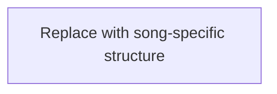

# {{ title }}

## Source Facts

- **Creator:** {{ creator }}
- **Source:** {{ source_url }}
- **Creator URL:** {{ creator_url }}
- **Collected at:** {{ collected_at }}

### Caption (raw)

```text
{{ caption_raw }}
```

### Style (raw)

```text
{{ style_raw }}
```

### Lyrics (raw)

```text
{{ lyrics_raw }}
```

---

## Clean Lyrics

{{ lyrics_clean }}

---

## Lyrics Analysis

### Summary

{{ lyrics_summary }}

### Themes

- 

### Core Keywords

- 

### Symbols / Motifs

- 

### Perspective

{{ perspective }}

### Repetition / Contrast / Notable Wording

- 

---

## Structure Analysis

- **Structure type:** {{ structure_type }}
- **Summary:** {{ structure_summary }}

### Mermaid



### Structural Notes

- 

---

## Suno Prompt Knowledge

### Style Raw

```text
{{ style_raw }}
```

### Directives Observed in Lyrics

| Directive | Position | Structural role | Source/Inference |
|---|---|---|---|
|  |  |  |  |

### Reusable Notes

- 

---

## Az Listening Notes

> No listening note yet.

### Raw Notes from Az

- 

### Structured Listening Tags

- **Perceived mood:**
- **Perceived instrumentation / texture:**
- **Energy change:**
- **Vocal impression:**
- **Favorite sonic moment:**
- **Useful reference for:**

> These fields must be based on Az's own listening notes. Do not infer them from audio files, Style, or lyrics alone.

---

## Az Impression

### Raw Notes from Az

> No Az note yet.

### Structured Impression

- **First impression:**
- **Favorite moment:**
- **Emotion words:**
- **Colors / scenery:**
- **Physical sensation:**
- **What felt unusual:**
- **Useful reference for:**

---

## Review Hooks

Points worth discussing when Az writes a review. These are prompts, not a finished review.

- 

---

## Provenance / Confidence

Clearly distinguish facts from interpretation.

- **Page-derived facts:**
- **AI text analysis:**
- **Az listening notes:**
- **Az impression:**
- **Unavailable / uncertain:**

### Audio Handling Policy

- Do not search for direct audio file URLs.
- Do not download or convert m4a/mp3/wav files.
- Do not perform automated audio analysis.
- Sound-related notes must come from Az's own listening comments.
