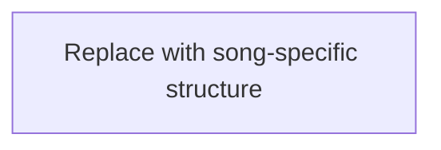

# {{ title }}

## Source Facts

- **Creator:** {{ creator }}
- **Source:** {{ source_url }}
- **Creator URL:** {{ creator_url }}
- **Collected at:** {{ collected_at }}

### Caption (raw)

```text
{{ caption_raw }}
```

### Style (raw)

```text
{{ style_raw }}
```

### Lyrics (raw)

```text
{{ lyrics_raw }}
```

---

## Clean Lyrics

{{ lyrics_clean }}

---

## Lyrics Analysis

### Summary

{{ lyrics_summary }}

### Themes

- 

### Core Keywords

- 

### Symbols / Motifs

- 

### Perspective

{{ perspective }}

### Repetition / Contrast / Notable Wording

- 

---

## Structure Analysis

- **Structure type:** {{ structure_type }}
- **Summary:** {{ structure_summary }}

### Mermaid



### Structural Notes

- 

---

## Music Analysis

> Record only what can actually be observed from the public audio. If audio could not be inspected, state that explicitly.

### Overall Sound

{{ overall_sound }}

### Instrumentation

- 

### Vocal

- 

### Energy / Density Curve

- 

### Section Transitions / Breaks / Climax

- 

---

## Suno Prompt Knowledge

### Style Raw

```text
{{ style_raw }}
```

### Directives Observed in Lyrics

| Directive | Position | Observed effect | Source/Inference |
|---|---|---|---|
|  |  |  |  |

### Reusable Notes

- 

---

## Az Impression

### Raw Notes from Az

> No Az note yet.

### Structured Impression

- **First impression:**
- **Favorite moment:**
- **Emotion words:**
- **Colors / scenery:**
- **Physical sensation:**
- **What felt unusual:**
- **Useful reference for:**

---

## Review Hooks

Points worth discussing when Az writes a review. These are prompts, not a finished review.

- 

---

## Provenance / Confidence

Clearly distinguish facts from interpretation.

- **Page-derived facts:**
- **Audio-derived observations:**
- **AI interpretation:**
- **Unavailable / uncertain:**
